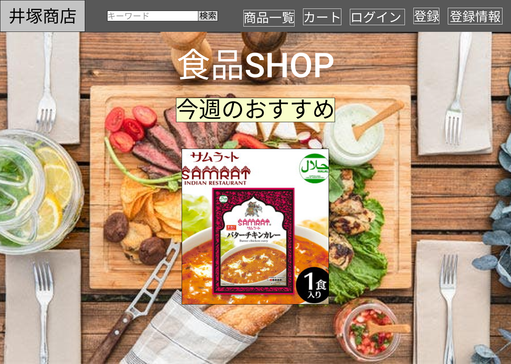

### 画面詳細図
## トップページ
### プロトタイプは以下のリンク先
[プロトタイプ](https://www.figma.com/file/iN4iPbRPMB0Yrkr3Ckt9mN/Untitled?node-id=0%3A1)
*****

*****
補足：対応DBの列はDB設計後、〇を対応するテーブル・カラム名に差し替えること。

| ID | 要素 | 内容 | アクション | イベント | 対応DB |
|----|------|------|------------|----------|--------|
|1   |バーナー|サイト名表示|-    |-         |-       |
|2   |キーワード|入力欄|テキスト入力|-      |〇|
|3   |検索  |ボタン|クリック|検索処理実行| |
|4   |商品一覧|画像ボタン|クリック|商品一覧に遷移|〇|
|5   |カート|画像ボタン|クリック|カートに遷移|〇|
|6   |ログイン|画像ボタン|クリック|ログインに遷移|〇|
|7   |登録|画像ボタン|クリック|登録に遷移|〇|
|8   |登録情報|画像ボタン|クリック|登録情報に遷移|〇|
|9   |食品SHOP|テキスト表示|-    |-          |-      |
|10  |今週のおすすめ|テキスト表示|- |-       |-      |
|11  |商品画像|画像リンク|クリック|商品詳細へ遷移|〇|
