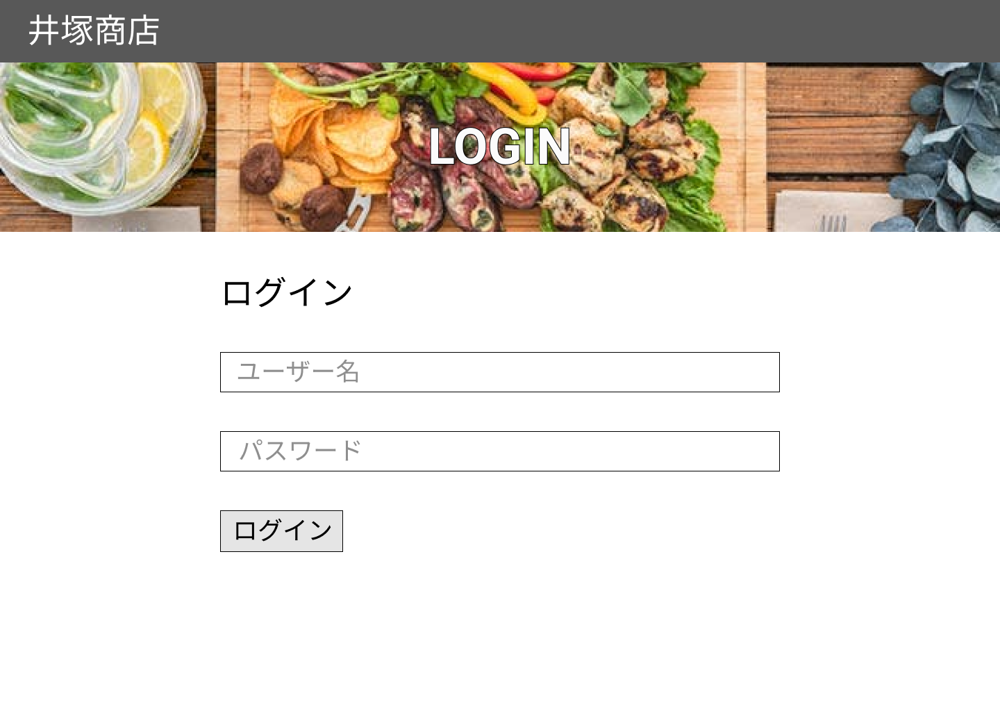

### 画面詳細図
## オリジナルログインページ
### プロトタイプは以下のリンク先
[プロトタイプ](https://www.figma.com/file/iN4iPbRPMB0Yrkr3Ckt9mN/Untitled?node-id=0%3A1)
*****

*****

| ID | 要素 | 内容 | アクション | イベント | 対応DB |
|----|------|------|-----------|----------|--------|
|1   |バナー|サイト名表示|-     |-         |-       |
|2   |LOGIN|テキスト表示|-     |-         |-       |
|3   |ログイン|テキスト表示|-   |-         |-       |
|4   |ユーザー名|入力欄|テキスト入力|-         |〇|
|5   |パスワード|入力欄|テキスト入力|-         |〇|
|6   |ログイン|ボタン|クリック|ログイン処理実行| |
