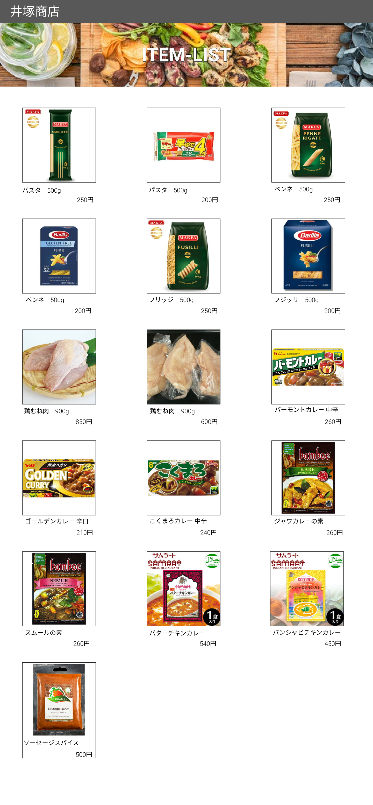

### 画面詳細図
## 商品一覧ページ
### プロトタイプは以下のリンク先
[プロトタイプ](https://www.figma.com/file/iN4iPbRPMB0Yrkr3Ckt9mN/Untitled?node-id=0%3A1)
*****

*****
補足：対応DBの列はDB設計後、〇を対応するテーブル・カラム名に差し替えること。

| ID | 要素 | 内容 | アクション | イベント | 対応DB |
|----|------|------|------------|----------|--------|
|1   |バーナー|サイト名表示|-    |-         |-       |
|2   |ITEM-LIST|テキスト表示|-    |-         |-       |
|3   |商品画像|画像リンク|クリック|商品詳細へ遷移|〇|
|4   |商品名|テキストリンク|クリック|商品詳細へ遷移|〇|
|5   |価格|テキスト表示|-         |-         |〇|
      |
