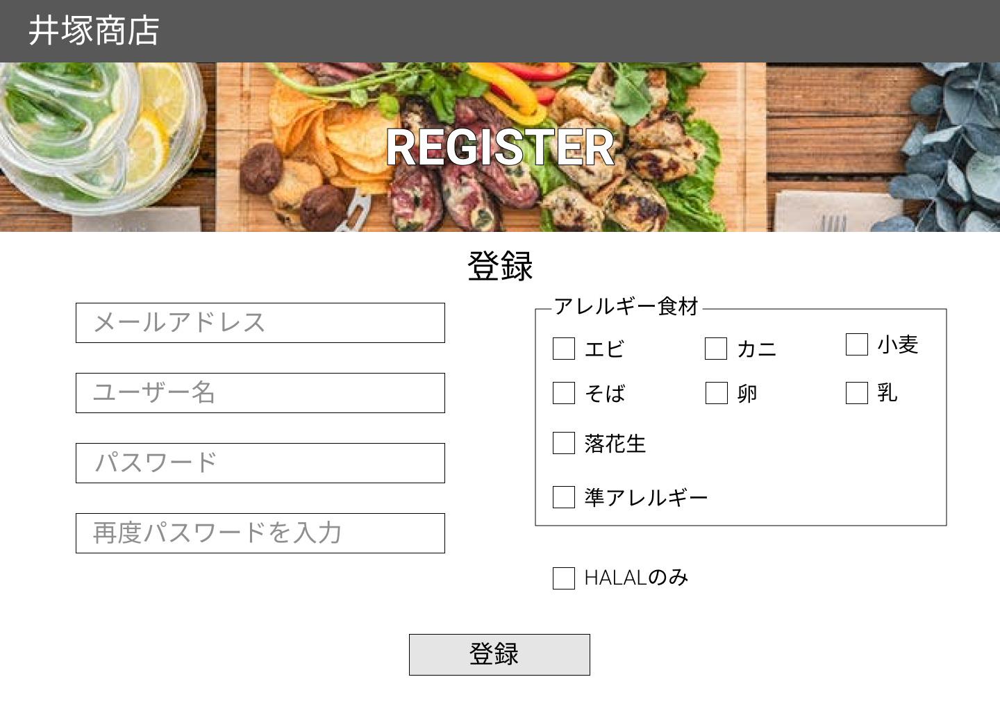

### 画面詳細図
## 登録ページ
### プロトタイプは以下のリンク先
[プロトタイプ](https://www.figma.com/file/iN4iPbRPMB0Yrkr3Ckt9mN/Untitled?node-id=0%3A1)
*****

*****

| ID | 要素 | 内容 | アクション | イベント | 対応DB |
|----|------|------|-----------|----------|--------|
|1   |バナー|サイト名表示|-     |-         |-       |
|2   |登録|テキスト表示|-     |-         |-       |
|3   |メールアドレス|入力欄|テキスト入力|-         |〇|
|4   |ユーザー名|入力欄|テキスト入力|-         |〇|
|5   |パスワード|入力欄|テキスト入力|-         |〇|
|6   |再度パスワードを入力|入力欄|テキスト入力|-         |〇|
|7   |アレルギー食材|テキスト表示|-     |-         |-       |
|8   |エビ|テキスト表示|-     |-         |-       |
|9   |エビ|チェックボックス|選択|-         |〇|
|10  |カニ|テキスト表示|-     |-         |-       |
|11  |カニ|チェックボックス|選択|-         |〇|
|12  |小麦|テキスト表示|-     |-         |-       |
|13  |小麦|チェックボックス|選択|-         |〇|
|14  |そば|テキスト表示|-     |-         |-       |
|15  |そば|チェックボックス|選択|-         |〇|
|16  |卵|テキスト表示|-     |-         |-       |
|17  |卵|チェックボックス|選択|-         |〇|
|18  |乳|テキスト表示|-     |-         |-       |
|19  |乳|チェックボックス|選択|-         |〇|
|20  |落花生|テキスト表示|-     |-         |-       |
|21  |落花生|チェックボックス|選択|-         |〇|
|22  |準アレルギー|テキスト表示|-     |-         |-       |
|23  |準アレルギー|チェックボックス|選択|-         |〇|
|24  |HALALのみ|テキスト表示|-     |-         |-       |
|25  |HALALUのみ|チェックボックス|選択|-         |〇|
|26  |登録|ボタン|クリック|登録処理実行|〇|
