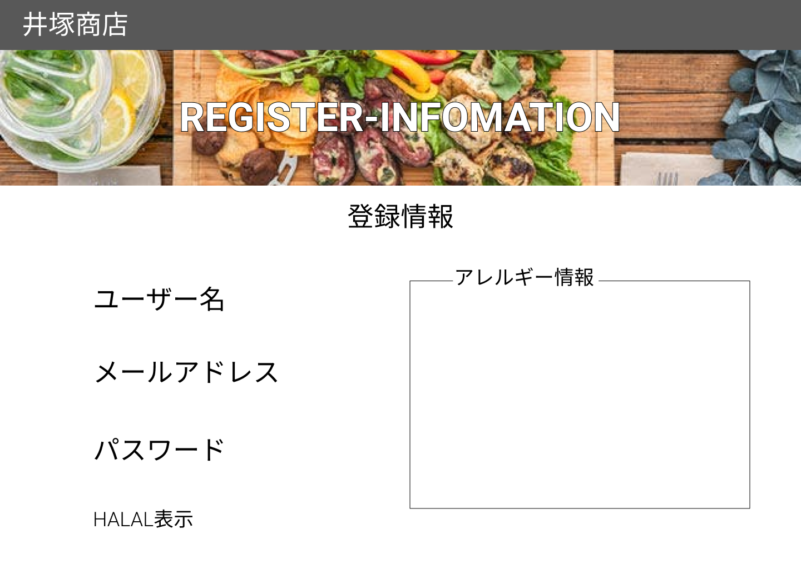

### 画面詳細図
## オリジナル登録情報ページ
### プロトタイプは以下のリンク先
[プロトタイプ](https://www.figma.com/file/iN4iPbRPMB0Yrkr3Ckt9mN/Untitled?node-id=0%3A1)
*****

*****

| ID | 要素 | 内容 | アクション | イベント | 対応DB |
|----|------|------|------------|----------|--------|
|1   |バーナー|サイト名表示|-    |-         |-       |
|2   |REGISTER-INFOMATION|テキスト表示|-    |-         |-       |
|3   |登録情報|テキスト表示|-    |-         |-       |
|4   |ユーザー名|テキスト表示|-    |-         |〇|
|5   |メールアドレス|テキスト表示|-    |-         |〇|
|6   |パスワード|テキスト表示|-    |-         |〇|
|7   |HALAL表示|テキスト表示|-    |-         |〇|
|8   |アレルギー情報|テキスト表示|-    |-         |-      |
